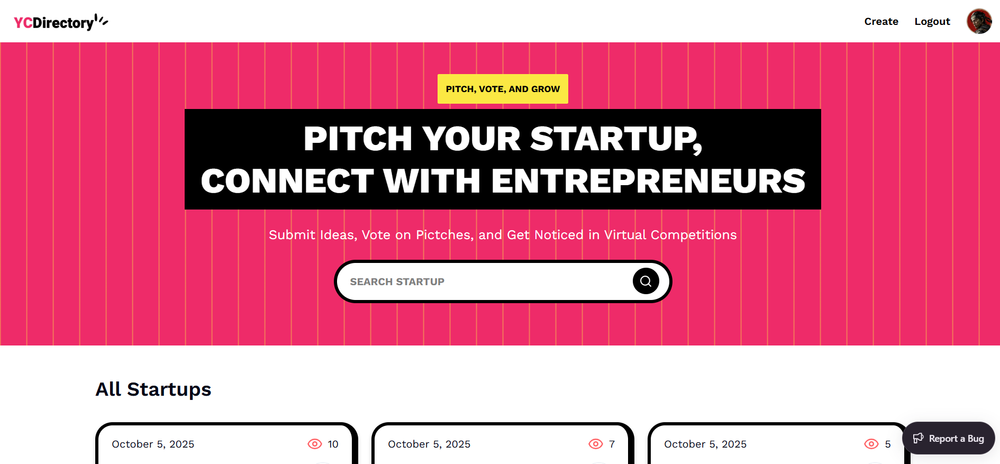

<div align="center">
    <a>
    
    </a>

  <h1>🚀 Startup Directory Platform</h1>
  <p>A simple Next.js platform to submit, explore, and showcase startup ideas.</p>

  <div>
    
    
    
    
  </div>
</div>

---

## 📦 Tech Stack

- **Next.js 15** – React framework  
- **React 19** – UI library  
- **Tailwind CSS** – Styling  
- **Sanity** – Headless CMS  
- **TypeScript** – Type safety  

---

## ✨ Features

- 🧠 **Submit Pitches:** Users can submit startup ideas with title, description, category, and media.  
- 🔍 **Search & Filter:** Browse ideas by category or search keywords.  
- 📄 **Pitch Details:** View complete pitch information with images or videos.  
- 👤 **Profile Page:** View all pitches submitted by a user.  
- 📈 **Views Counter:** Track pitch popularity.  
- 🏆 **Editor Picks:** Highlight top ideas as chosen by admins.  

---

## ⚙️ Getting Started

### 1. Clone the repository

```bash
git clone https://github.com/JavaScript-Mastery-Pro/pitchify.git
cd pitchify 
```

### 2. Install dependencies
```bash
npm install
```

### 3. Set up environment variables
Create a .env.local file in the project root:
```bash
NEXT_PUBLIC_SANITY_PROJECT_ID=
NEXT_PUBLIC_SANITY_DATASET=
NEXT_PUBLIC_SANITY_API_VERSION='vX'
SANITY_TOKEN=

AUTH_SECRET= 
AUTH_GITHUB_ID=
AUTH_GITHUB_SECRET=
```
### 4. Run the development server
```bash
npm run dev
```